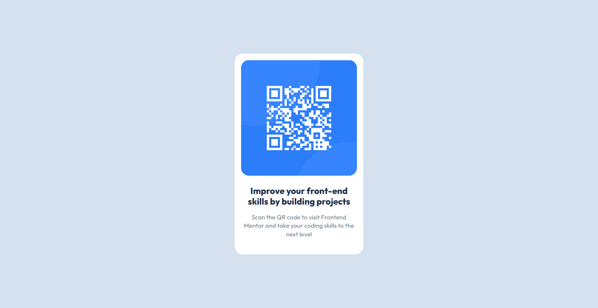

# Frontend Mentor - QR code component solution

This is a solution to the [QR code component challenge on Frontend Mentor](https://www.frontendmentor.io/challenges/qr-code-component-iux_sIO_H). Frontend Mentor challenges help you improve your coding skills by building realistic projects.

## Table of contents

- [Overview](#overview)
  - [Screenshot](#screenshot)
  - [Links](#links)
- [Built with](#built-with)
- [Author](#author)

## Overview

### Screenshot

### Links

- Solution URL: [Add solution URL here](https://github.com/tiedsandi/QR-code-component-Fe_challange)
- Live Site URL: [Add live site URL here](https://sandi-fe-qr-code.netlify.app)

## Built with

- [Next.js](https://nextjs.org/) - React framework

## Author

- Website - [Fachran Sandi](https://fachran-sandi.netlify.app/)
- Frontend Mentor - [@tiedsandi](https://www.frontendmentor.io/profile/tiedsandi)
- LinkedIn - [@fachransandi](https://www.linkedin.com/in/fachransandi/)
- Github - [@tiedsandi](https://github.com/tiedsandi)
